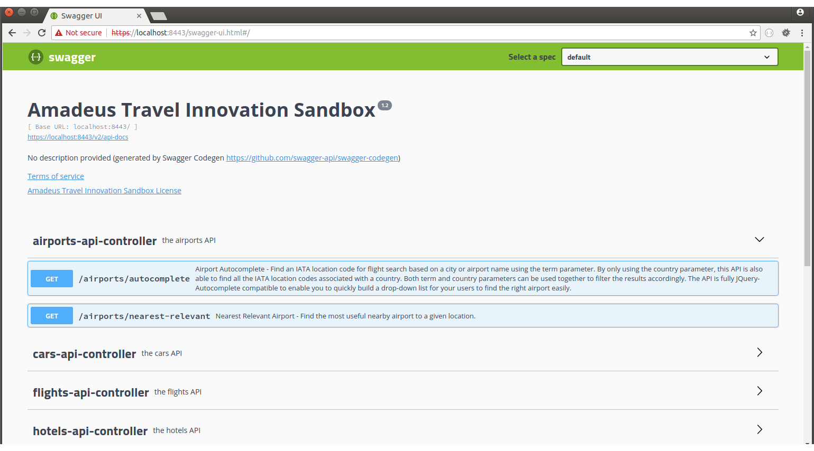

# SpringBoot/HTTP2

Spring-Boot with REST using Undertow over HTTP2 

# Requisites

1. [Java](http://www.oracle.com/technetwork/java/javase/downloads/jdk8-downloads-2133151.html) 8+
2. [Maven](https://maven.apache.org/download.cgi) 3+

# Play

```
mvn spring-boot:run
```

# Access

```
https://localhost:8443/swagger-ui.html

```



# Optionals

HTTP 1.1

```
mvn spring-boot:run -Dserver.ssl.enabled=false -Dserver.http2.enabled=false
```

Server Port

```
mvn spring-boot:run -Dserver.port=9090
```


# References

* [HTTP2 Configuration](http://www.baeldung.com/spring-boot-application-configuration)

* [Undertow from JBOSS](http://undertow.io)

* [Swagger Configuration](http://www.baeldung.com/swagger-2-documentation-for-spring-rest-api)

* [Certificate SSL](https://www.thomasvitale.com/https-spring-boot-ssl-certificate)

* [Swagger Codegen](https://github.com/swagger-api/swagger-codegen)

* [Swagger Codegen with Maven](https://www.clianz.com/2016/05/29/java-mvc-swagger-gen/)